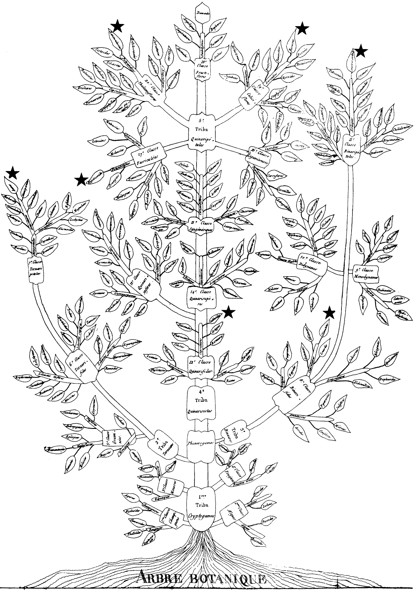
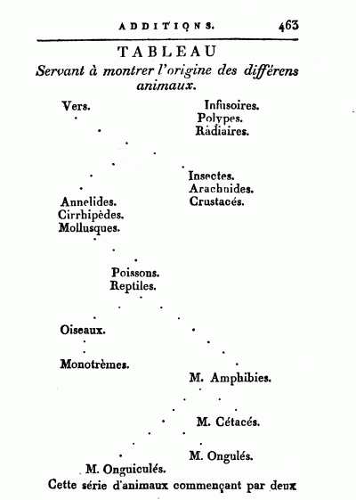
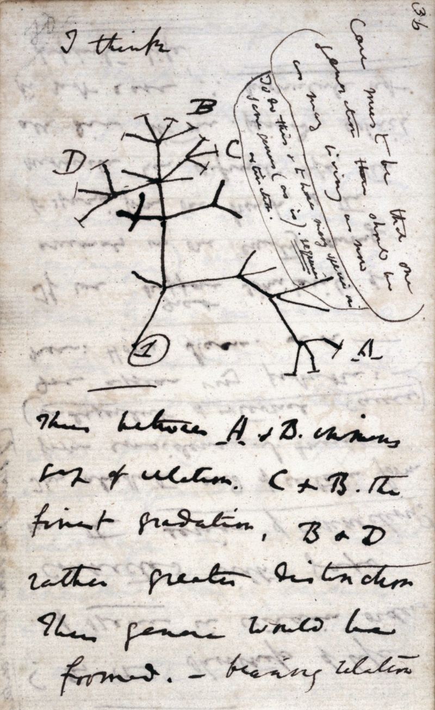
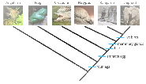
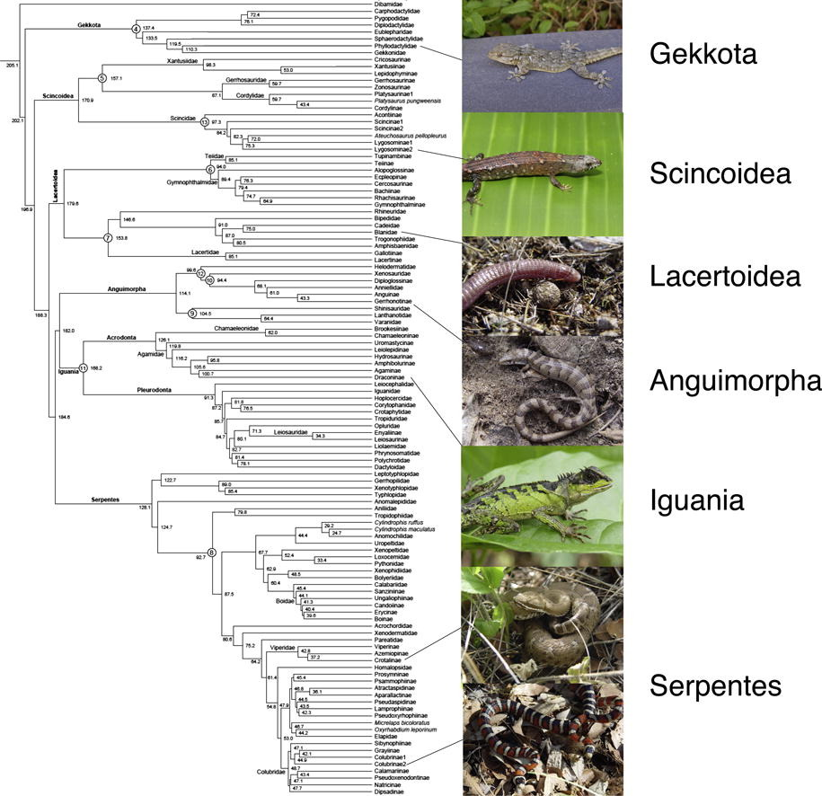
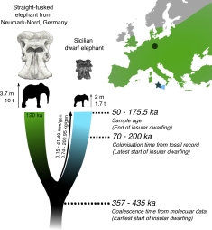

```{r setup, include = FALSE}
library(knitr)
library(ape)
```

<!-- adding bold and italic options -->
<style>
em {
  font-style: italic
}
strong {
  font-weight: bold;
}
</style>

## Lecture schedule

1. Drift and variation (Evolution: Chapter 6)
2. Conservation genetics (Evolution: Chapter 6)
3. **Phylogeny 1 (Evolution: Chapter 16)**
4. Phylogeny 2 (Evolution: Chapter 16)

---

## Sabretooth cats

```{r, out.width = "60%", dpi = 300, echo = FALSE, fig.align='right', fig.cap=""}
include_graphics("./assets/img/smilodon1.png")
```

---

## Sabretooth cats

```{r, out.width = "85%", dpi = 300, echo = FALSE, fig.align='center', fig.cap=""}
include_graphics("./assets/img/sabre_tree.svg")
```

--- .segue .dark 

## What is a phylogeny?

--- &twocol

## A representation of the evolutionary process

*** =right

```{r, out.width = "100%", fig.width = 3, fig.height = 3, dpi = 600, fig.align = "center", echo = FALSE, fig.cap=""}

my.t <- read.tree(text="((((human,chimp),(cat,dog)),(snake,lizard)),fish);")
par(mar=c(1,1,1,1))
plot(my.t)
```

*** =left

- Models how evolution works
- An evolutionary tree
- The tips are species
- Nodes are their common ancestors
- All species descend from a single common ancestor

---

## Key process: Vertical gene transfer

```{r, out.width = "85%", dpi = 300, echo = FALSE, fig.align='center', fig.cap=""}
include_graphics("./assets/img/desc1.svg")
```

---

## Key process: Vertical gene transfer

```{r, out.width = "85%", dpi = 300, echo = FALSE, fig.align='center', fig.cap=""}
include_graphics("./assets/img/desc2.svg")
```

---

## Key process: Vertical gene transfer

```{r, out.width = "85%", dpi = 300, echo = FALSE, fig.align='center', fig.cap=""}
include_graphics("./assets/img/bears.svg")
```

---

## Not a progression

```{r, out.width = "85%", dpi = 300, echo = FALSE, fig.align='center', fig.cap=""}
include_graphics("./assets/img/Human_evolution.svg")
```

--- bg:white

```{r, out.width = "80%", dpi = 300, echo = FALSE, fig.align='center', fig.cap=""}
include_graphics("./assets/img/matthew_bonnan.png")
```

Credit: Dr. Matthew Bonnan

---

### If humans evolved from monkeys, then why are there still monkeys?

```{r, out.width = "90%", dpi = 300, echo = FALSE, fig.align='center', fig.cap=""}

```

--- .segue .dark 

## History

--- &twocol bg:white

*** =left

### Earliest tree. Augustin Augier, 1801

*** =right

```{r, out.width = "95%", dpi = 300, echo = FALSE, fig.align='center', fig.cap=""}

```

--- &twocol bg:white

*** =left

### First branching tree of animals. Lamarck, 1809

*** =right

```{r, out.width = "95%", dpi = 300, echo = FALSE, fig.align='center', fig.cap=""}

```

--- bg:white

### First tree based on fossils. Hitchcock, 1840

```{r, out.width = "70%", dpi = 300, echo = FALSE, fig.align='center', fig.cap=""}
include_graphics("./assets/img/hitchcock.png")
```

--- &twocol bg:white

*** =left

### First evolutionary tree (non-creationist). Darwin, 1837

*** =right

```{r, out.width = "80%", dpi = 300, echo = FALSE, fig.align='center', fig.cap=""}

```

--- bg:white

### Refined for “On the Origin of Species”, Darwin, 1859

```{r, out.width = "70%", dpi = 300, echo = FALSE, fig.align='center', fig.cap=""}
include_graphics("./assets/img/darwin2.png")
```

--- &twocol bg:white

*** =left

### Position of humans in the tree. Haeckel, 1879

*** =right

```{r, out.width = "80%", dpi = 300, echo = FALSE, fig.align='center', fig.cap=""}
include_graphics("./assets/img/haekel.png")
```

--- bg:white

<iframe src = 'https://www.onezoom.org/life/@biota=93302?otthome=%40%3D44565#x400,y581,w0.7630'></iframe>

--- .segue .dark 

## Phylogenetics: the study of phylogenies

--- &twocol

## Phylogenetics 

*** =left

- An entire field of evolutionary biology!
- Combines knowledge from multiple areas: 
  - evolutionary biology
  - genetics
  - mathematics
  - computer science
  - Multiple specific journals

*** =right

```{r, out.width = "60%", dpi = 300, echo = FALSE, fig.align='center', fig.cap=""}

```

--- &twocol

## Data: Morphology

*** =left

- suitable for fossil and living species
- generally based on **shared derived** characteristics 
- ancestral states identified using **outgroup**
- optimal tree selected based on **parsimony**
- limited numbers of characters may be available
- generally no model of evolution
- **Homoplasy** is independent evolution of similar states
  - convergent evolution
  - parallel evolution
  - reversal

*** =right

```{r, out.width = "50%", dpi = 300, echo = FALSE, fig.align='right', fig.cap=""}
include_graphics("./assets/img/gfreern.svg")
```

--- bg:white

## Data: Morphology

```{r, out.width = "90%", dpi = 300, echo = FALSE, fig.align='center', fig.cap=""}

```

--- &twocol

## Data: genetics

*** =left

- DNA, RNA or amino acid sequences
- Many characters
- Simple model of substitution
- many analytical methods
- Molecular clock
- evolution can be complex
- Difficult to apply to fossils (ancient DNA)
- Homoplasy still exists
- saturation by repeated substitutions

*** =right

```{r, out.width = "100%", dpi = 300, echo = FALSE, fig.align='right', fig.cap=""}
include_graphics("./assets/img/dna-1889085.jpg")
```

--- &twocol

## Gene tree (single locus tree)

*** =left

- Evolutionary history of a single locus
- (not always an actual gene)
- Each locus has its own gene tree
- Easy to calculate using genetic data (often sequences)
- Historical reliance on mitochondrial DNA
- Gene trees may differ among loci
  - **incomplete lineage sorting**
  - **admixture**
  
**More in next lecture**

*** =right

```{r, out.width = "75%", dpi = 300, echo = FALSE, fig.align='right', fig.cap=""}
include_graphics("./assets/img/Gene_Loci_and_Alleles.png")
```

---

## Terminology

```{r, out.width = "90%", dpi = 300, echo = FALSE, fig.align = "center", fig.cap=""}
  include_graphics("./assets/img/term.png")
```

--- &twocol

## Clades

*** =left

- A clade contains one ancestor and all its descendents
- It is a monophyletic group
- Modern taxonomy (generally) tries to align with clades
- Not case for all:
  - lizards
  - reptiles
  - colubrids
  - toads
  - birds of prey

*** =right

```{r, out.width = "100%", dpi = 300, echo = FALSE, fig.align = "center", fig.cap=""}
  
```

--- .segue .dark 

## Using phylogenies

--- &twocol

## Understanding evolution of novel traits

*** =left

**Giant beaver (*Castoroides*)**

- 2 m long, up to 125 kg, 15 cm incisors
- Extinct ~12 Ka, coinciding with arrival of Clovis people
- Several derived adapatations for wood cutting and aquatic life
- Information on evolution of "ecosystem engineers"?

*** =right

```{r, out.width = "85%", dpi = 300, echo = FALSE, fig.align='center', fig.cap=""}
include_graphics("./assets/img/castoroides-size.jpg")
```

```{r, out.width = "85%", dpi = 300, echo = FALSE, fig.align='center', fig.cap=""}
include_graphics("./assets/img/Giant-beaver-fieldmuseum.jpg")
```

---

## Giant beaver mitogenome phylogeny

```{r, out.width = "80%", dpi = 300, echo = FALSE, fig.align='center', fig.cap=""}
include_graphics("./assets/img/castor_tree.svg")
```

---

## Giant beaver mitogenome phylogeny

```{r, out.width = "100%", out.height=500, dpi = 300, echo = FALSE, fig.cap=""}
  include_graphics("./assets/img/Xenikoudakis et al. - 2020 - Ancient DNA reveals twenty million years of aquatic life in beavers.pdf")
```

--- &twocol

## Measuring trait evolution

*** =left

**Mediterranean Dwarf elephants**

- Multiple Mediterranean islands
- 1.5 to 2.3 m at shoulder
- Direct ancestor is *Palaeoloxodon antiquus*
- Example of insular dwarfism
- Phylogeny could provide information on the dwarfing rate


*** =right

```{r, out.width = "60%", dpi = 300, echo = FALSE, fig.align='center', fig.cap=""}
include_graphics("./assets/img/Elephas mnaidriensis Grotta Puntali di notte.jpg")
```

```{r, out.width = "100%", dpi = 300, echo = FALSE, fig.align='center', fig.cap=""}
include_graphics("./assets/img/Palaeoloxodon_falconeri_Size_Comparison.svg.png")
```

---

## Dwarfing rate

```{r, out.width = "90%", dpi = 300, echo = FALSE, fig.align='center', fig.cap=""}

```

--- bg:white

## Dwarfing rate

```{r, out.width = "50%", dpi = 300, echo = FALSE, fig.align='center', fig.cap=""}

```

---

## Dwarfing rate

```{r, out.width = "100%", out.height=500, dpi = 300, echo = FALSE, fig.cap=""}
  include_graphics("./assets/img/Baleka et al. - 2021 - Estimating the dwarfing rate of an extinct Sicilian elephant.pdf")
```

--- &twocol

## Comparative phylogenetic method

*** =left

- species share an evolutionary history
- a trait in many species may result from a single evolutionary shift
- traits may evolve in a distant ancestor
- need to locate evolutionary shifts on the phylogeny

*** =right

```{r, out.width = "100%", out.height=500, dpi = 300, echo = FALSE, fig.cap=""}
  include_graphics("./assets/img/bird_bird_fish.svg")
```

---

## Venom evolution in saw-scaled vipers

```{r, out.width = "100%", out.height=500, dpi = 300, echo = FALSE, fig.cap=""}
  include_graphics("./assets/img/echis.svg")
```

---

## Venom evolution in saw-scaled vipers

```{r, out.width = "100%", out.height=500, dpi = 300, echo = FALSE, fig.cap=""}
  
```

--- &twocol

## Species discovery and delimitation

*** =left

- Divergent clades and lineages may be separate species
- Needs me backed up with additional evidence
  - Morphology
  - Behaviour
  - Multiple loci??
  - etc...

### Example: Zimbabwe rinkhals

*** =right

```{r, out.width = "100%", out.height=500, dpi = 300, echo = FALSE, fig.cap=""}
  include_graphics("./assets/img/hema.svg")
```

--- bg:white

## Zimbabwe rinkhals

```{r, out.width = "110%", out.height=500, fig.align='center', dpi = 300, echo = FALSE, fig.cap=""}
  include_graphics("./assets/img/hema2.svg")
```

--- bg:white

## Zimbabwe rinkhals

```{r, out.width = "100%", out.height=500, fig.align='left', dpi = 300, echo = FALSE, fig.cap=""}
  include_graphics("./assets/img/hema3.svg")
```

---

## Zimbabwe rinkhals

```{r, out.width = "100%", out.height=500, dpi = 300, echo = FALSE, fig.cap=""}
  include_graphics("./assets/img/Major et al. - 2023 - Museum DNA reveals a new, potentially extinct species of rinkhals (Serpentes Elapidae Hemachatus).pdf")
```

--- &thankyou

## Next time:

**More phylogeny...**

