<!-- adding bold and italic options -->

## Lecture schedule

1. Drift and variation (Evolution: Chapter 6)
2. Conservation genetics (Evolution: Chapter 6)
3. **Phylogeny 1 (Evolution: Chapter 16)**
4. Phylogeny 2 (Evolution: Chapter 16)

---

## Sabretooth cats

---

## Sabretooth cats

--- .segue .dark 

## What is a phylogeny?

--- &twocol

## A representation of the evolutionary process

*** =right

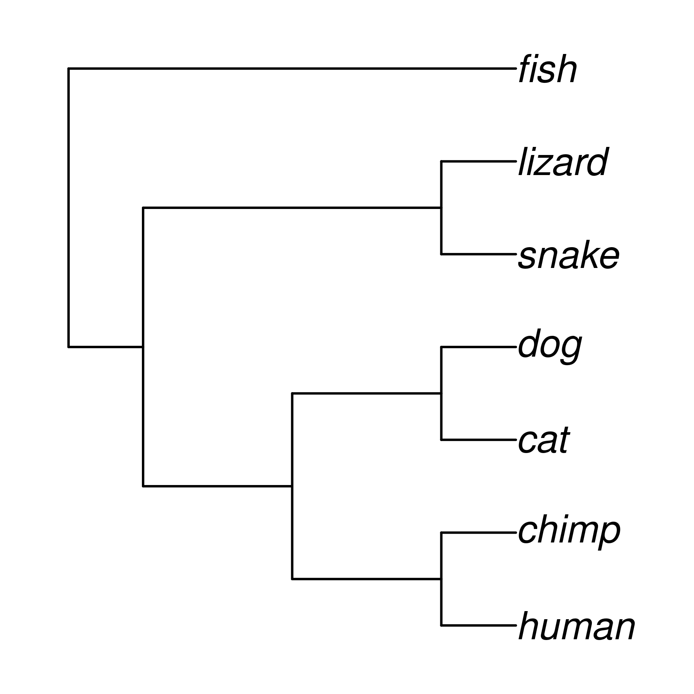

*** =left

- Models how evolution works
- An evolutionary tree
- The tips are species
- Nodes are their common ancestors
- All species descend from a single common ancestor

---

## Key process: Vertical gene transfer

---

## Key process: Vertical gene transfer

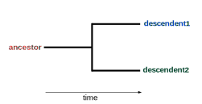

---

## Key process: Vertical gene transfer

---

## Not a progression

--- bg:white

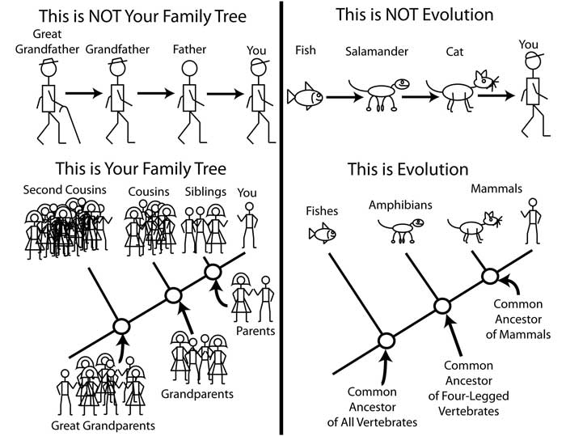

Credit: Dr. Matthew Bonnan

---

### If humans evolved from monkeys, then why are there still monkeys?

--- .segue .dark 

## History

--- &twocol bg:white

*** =left

### Earliest tree. Augustin Augier, 1801

*** =right

--- &twocol bg:white

*** =left

### First branching tree of animals. Lamarck, 1809

*** =right

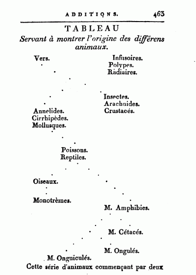

--- bg:white

### First tree based on fossils. Hitchcock, 1840

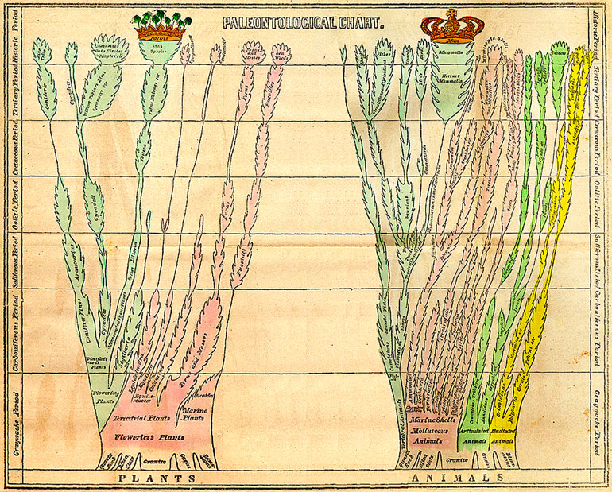

--- &twocol bg:white

*** =left

### First evolutionary tree (non-creationist). Darwin, 1837

*** =right

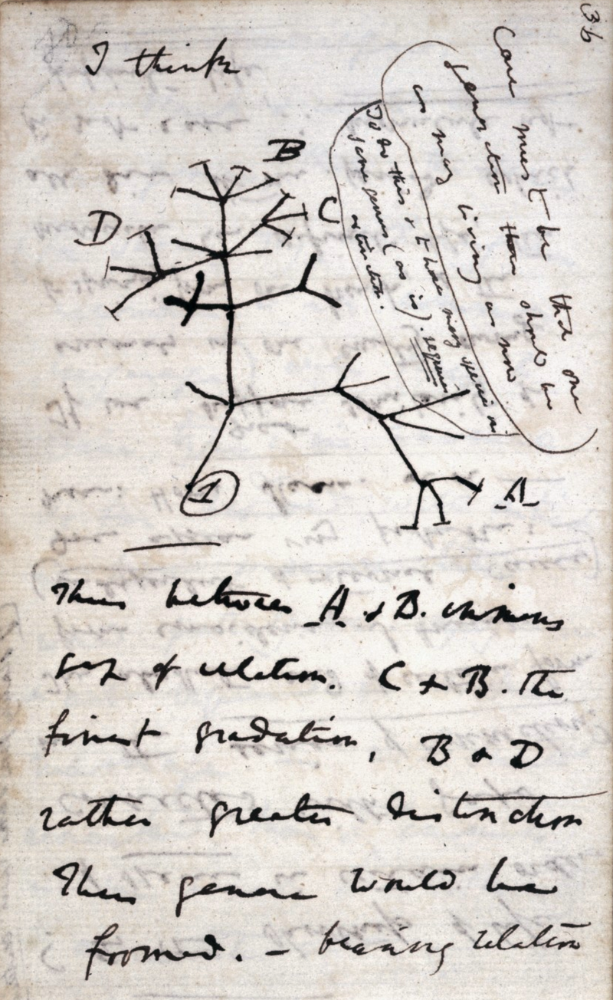

--- bg:white

### Refined for “On the Origin of Species”, Darwin, 1859

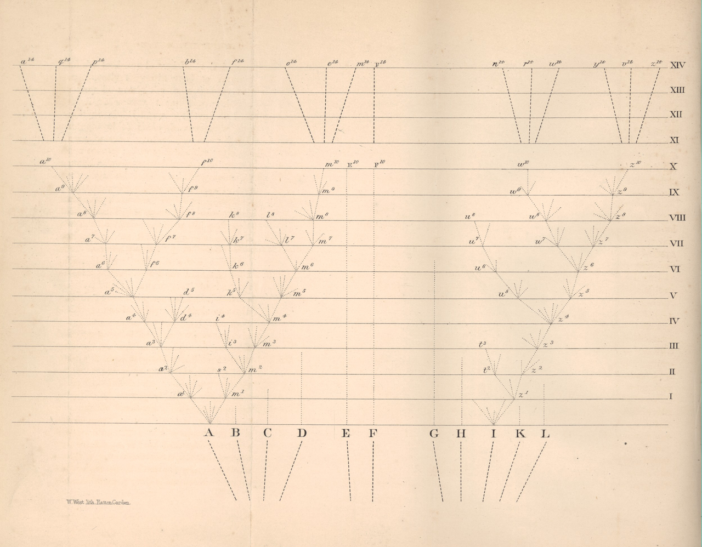

--- &twocol bg:white

*** =left

### Position of humans in the tree. Haeckel, 1879

*** =right

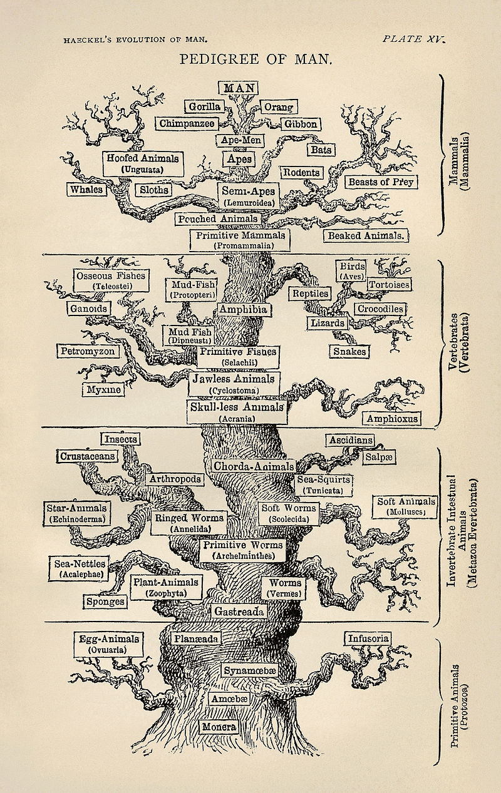

--- bg:white

<iframe src = 'https://www.onezoom.org/life/@biota=93302?otthome=%40%3D44565#x400,y581,w0.7630'></iframe>

--- .segue .dark 

## Phylogenetics: the study of phylogenies

---

## Phylogenetics 

- An entire field of evolutionary biology!
- Combines knowledge from multiple areas: 
- evolutionary biology
- genetics
- mathematics
- computer science
- Multiple specific journals

--- &twocol

## Data: Morphology

*** =left

- suitable for fossil and living species
- generally based on **shared derived** characteristics 
- ancestral states identified using **outgroup**
- optimal tree selected based on **parsimony**
- limited numbers of characters may be available
- generally no model of evolution
- **Homoplasy** is independent evolution of similar states
  - convergent evolution
  - parallel evolution
  - reversal

*** =right

--- bg:white

## Data: Morphology

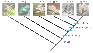

--- &twocol

## Data: genetics

*** =left

- DNA, RNA or amino acid sequences
- Many characters
- Simple model of substitution
- many analytical methods
- Molecular clock
- evolution can be complex
- Difficult to apply to fossils (ancient DNA)
- Homoplasy still exists
- saturation by repeated substitutions

*** =right

--- &twocol

## Gene tree (single locus tree)

*** =left

- Evolutionary history of a single locus
- (not always an actual gene)
- Any recombining genome has multiple loci, each with its own gene tree
- Easy to calculate using genetic data (often sequences)
- Historical reliance on mitochondrial DNA
- Gene trees may differ
  - **incomplete lineage sorting**
  - **admixture**
  
**More in next lecture**

*** =right

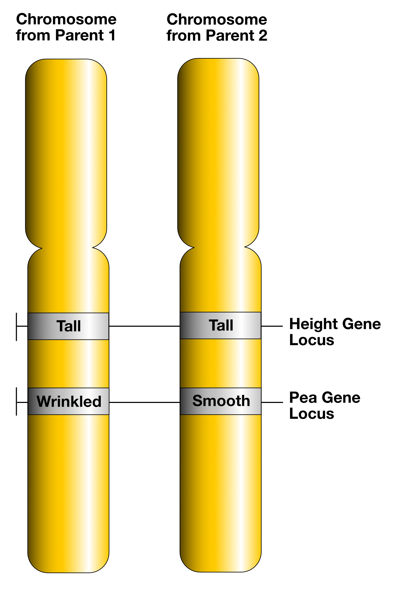

---

## Terminology

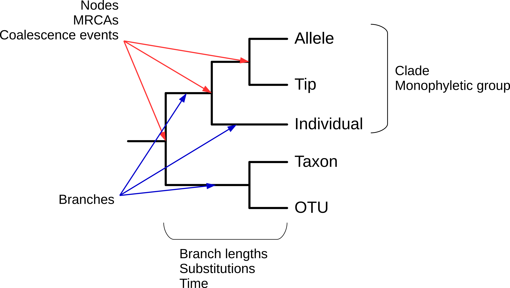

--- &twocol

## Clades

*** =left

- A clade contains one ancestor and all its descendents
- It is a monophyletic group
- Modern taxonomy (generally) tries to align with clades
- Not case for all:
  - lizards
  - reptiles
  - elapids
  - toads
  - birds of prey

*** =right

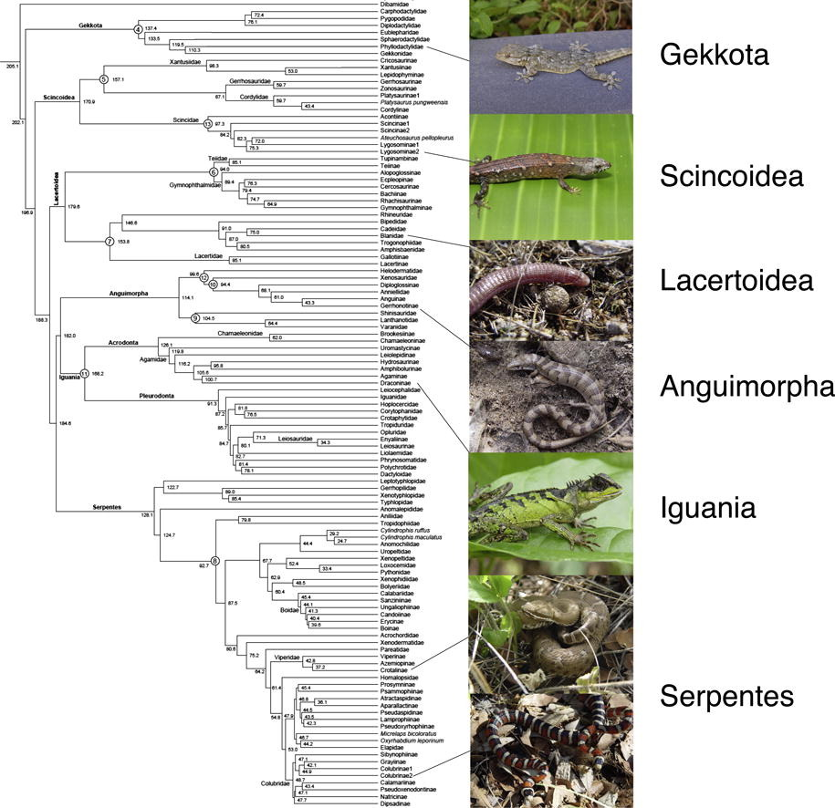

--- .segue .dark 

## Using phylogenies

--- &twocol

## Placing enigmatic taxa in the tree

*** =left

- Understand relationships of problematic taxa
- Genetic methods especially useful
- Molecular dating 
- Recent trend for extinct species

*** =right

--- &twocol

## Understanding evolution of novel traits

*** =left

**Giant beaver (*Castoroides*)**

- 2 m long, up to 125 kg, 15 cm incisors
- Extinct ~12 Ka, coinciding with arrival of Clovis people
- Several derived adapatations for wood cutting and aquatic life
- Information on evolution of "ecosystem engineers"?

*** =right

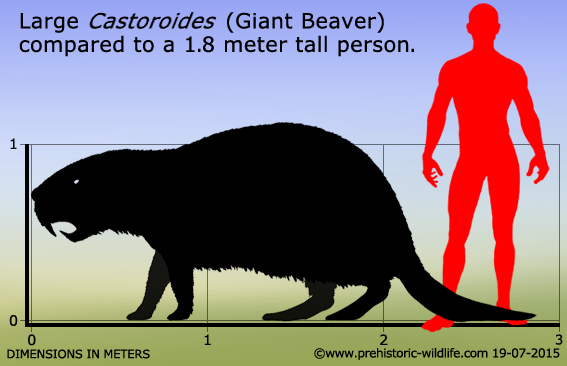

---

## Giant beaver mitogenome phylogeny

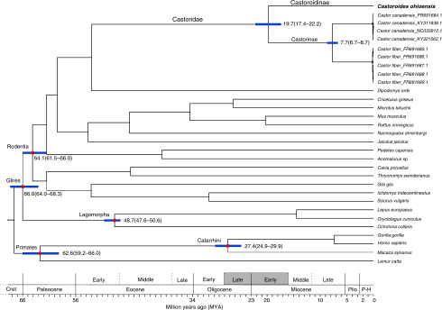

---

## Giant beaver mitogenome phylogeny

<embed src="./assets/img/Xenikoudakis et al. - 2020 - Ancient DNA reveals twenty million years of aquatic life in beavers.pdf" width="100%" height="500" type="application/pdf" />

--- &twocol

## Measuring trait evolution

*** =left

**Mediterranean Dwarf elephants**

- Multiple Mediterranean islands
- 1.5 to 2.3 m at shoulder
- Direct ancestor is *Palaeoloxodon antiquus*
- Example of insular dwarfism
- Phylogeny could provide information on the dwarfing rate

*** =right

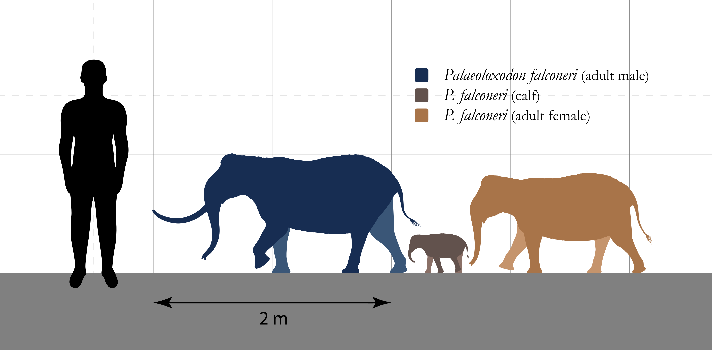

---

## Dwarfing rate

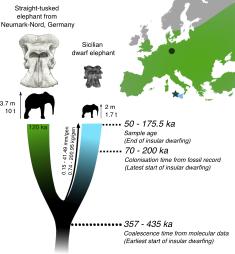

---

## Dwarfing rate

<embed src="./assets/img/Baleka et al. - 2021 - Estimating the dwarfing rate of an extinct Sicilian elephant.pdf" width="100%" height="500" type="application/pdf" />

--- &twocol

## Comparative phylogenetic method

*** =left

- species share an evolutionary history
- a trait in many species may result from a single evolutionary shift
- traits may evolve in a distant ancestor
- need to locate evolutionary shifts on the phylogeny

*** =right

---

## Venom evolution in saw-scaled vipers

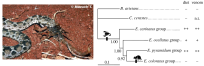

--- &twocol

## Species discovery and delimitation

*** =left

- Divergent clades and lineages may be separate species
- Needs me backed up with additional evidence
  - Morphology
  - Behaviour
  - Multiple loci??
  - etc...

### Example: Zimbabwe rinkhals

*** =right

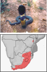

--- bg:white

## Zimbabwe rinkhals

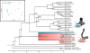

---

## Zimbabwe rinkhals

<embed src="./assets/img/Major et al. - 2023 - Museum DNA reveals a new, potentially extinct species of rinkhals (Serpentes Elapidae Hemachatus).pdf" width="100%" height="500" type="application/pdf" />

--- &thankyou

## Next time:

**More phylogeny...**

